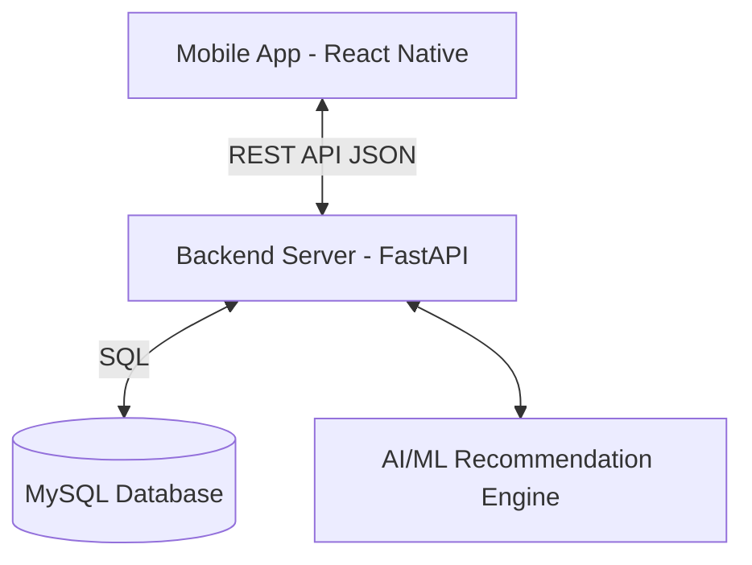

# NutriTrack AI - Project Architecture

## 1. System Overview
NutriTrack AI is a comprehensive mobile application designed to help parents monitor their child's nutrition, growth, and overall health. The system consists of a mobile frontend for users, a RESTful backend API for business logic, and a relational database for data persistence.

## 2. Technology Stack

### Mobile Frontend
- **Framework:** React Native (Expo)
- **Language:** JavaScript / TypeScript
- **UI Components:** React Native Paper
- **Charts:** React Native Chart Kit
- **Navigation:** React Navigation (Bottom Tabs, Stack)
- **Networking:** Axios
- **Local Storage:** AsyncStorage

### Backend API
- **Framework:** FastAPI (Python)
- **Server:** Uvicorn
- **ORM:** SQLAlchemy
- **Authentication:** JWT (JSON Web Tokens), bcrypt
- **Data Analytics:** Pandas, NumPy, Scikit-learn (for AI recommendations)

### Database
- **Type:** Relational
- **Engine:** MySQL

## 3. High-Level Architecture Diagram

## 4. Folder Structure

- `mobile/`: React Native Expo project containing components, screens, services.
- `backend/`: FastAPI project with routes, models, schemas, and AI logic.
- `database/`: SQL schemas, sample data scripts.
- `ai/`: Jupyter notebooks or experimental scripts for recommendation modeling.
- `docs/`: Project documentation and reports.
- `tests/`: Automated test suites for both mobile and backend.

## 5. Security & Authentication
- All API endpoints (except register/login) are protected by JWT.
- Passwords are hashed using bcrypt before storing in MySQL.
- Role-based Access Control (Parent, Nutritionist, Admin).

## 6. Data Flow
1. **User Action:** Parent inputs a meal in the mobile app.
2. **API Request:** Mobile sends POST `/meals` with food IDs and quantities.
3. **Backend Processing:** FastAPI validates token, calculates total nutrition based on food database.
4. **Database Save:** Meal and calculated nutrients are saved to MySQL.
5. **API Response:** Success response sent back to mobile.
6. **UI Update:** Mobile updates the Nutrition Dashboard state.
